# 🔗 Orquestração do Data Lake (Step Functions + EventBridge)

> **20 Step Functions**, **17 crawlers** e **49 agendamentos**. As SFN rodam jobs/crawlers em sequência;
> o encadeamento **entre** SFNs é por **regras EventBridge** (quando um job conclui `SUCCEEDED`, inicia a próxima SFN);
> e as cadeias **começam** por **agendamentos** (cron/rate) — ver seção *Agendamentos*.
> **Não editar à mão** — regerável pela skill `catalogo-datalake`.

## Cadeias (a partir de cada gatilho externo)

> Raiz = SFN sem regra de encadeamento apontando para ela (início por aplicação/webhook ou agenda).

- [[gex-bronze-to-silver-buygoods-prod]]
  - ▶️ job [[bronze-to-silver-buygoods-prod]] `SUCCEEDED` ⟶
    - [[gex-buygoods-unified-to-mysql-prod]]
      - ▶️ job [[gex-buygoods-unified-to-mysql-prod]] `SUCCEEDED` ⟶
        - [[gex-buygoods-gold-prod]]
  - ▶️ job [[bronze-to-silver-buygoods-prod]] `SUCCEEDED` ⟶
    - [[gex-silver-to-mysql-buygoods-prod]]

- [[gex-bronze-to-silver-clickbank-prod]]
  - ▶️ job [[gex-bronze-to-silver-prod]] `SUCCEEDED` ⟶
    - [[gex-silver-gold-to-mysql-clickbank-prod]]

- [[gex-clickbank-config-daily-develop]]

- [[gex-clickbank-config-daily-prod]]

- [[gex-clickbank-ingestion-old-develop]]

- [[gex-clickbank-ingestion-old-prod]]

- [[gex-gold-dashboard-channels-marketing-develop]]

- [[gex-gold-dashboard-channels-marketing-prod]]

- [[gex-gold-to-mysql-channels-marketing-develop]]

- [[gex-gold-to-mysql-channels-marketing-prod]]

- [[gex-mysql-leads-daily-develop]]

- [[gex-mysql-leads-daily-prod]]

- [[gex-mysql-sales-hourly-develop]]

- [[gex-mysql-sales-hourly-prod]]

- [[gex-silver-gold-to-mysql-clickbank-develop]]

- [[gex-silver-to-gold-clickbank-prod]]

## Grafo (mermaid)

```mermaid
flowchart TD
  gex_bronze_to_silver_buygoods_prod["gex-bronze-to-silver-buygoods-prod"]
  gex_bronze_to_silver_clickbank_prod["gex-bronze-to-silver-clickbank-prod"]
  gex_buygoods_gold_prod["gex-buygoods-gold-prod"]
  gex_buygoods_unified_to_mysql_prod["gex-buygoods-unified-to-mysql-prod"]
  gex_clickbank_config_daily_develop["gex-clickbank-config-daily-develop"]
  gex_clickbank_config_daily_prod["gex-clickbank-config-daily-prod"]
  gex_clickbank_ingestion_old_develop["gex-clickbank-ingestion-old-develop"]
  gex_clickbank_ingestion_old_prod["gex-clickbank-ingestion-old-prod"]
  gex_gold_dashboard_channels_marketing_develop["gex-gold-dashboard-channels-marketing-develop"]
  gex_gold_dashboard_channels_marketing_prod["gex-gold-dashboard-channels-marketing-prod"]
  gex_gold_to_mysql_channels_marketing_develop["gex-gold-to-mysql-channels-marketing-develop"]
  gex_gold_to_mysql_channels_marketing_prod["gex-gold-to-mysql-channels-marketing-prod"]
  gex_mysql_leads_daily_develop["gex-mysql-leads-daily-develop"]
  gex_mysql_leads_daily_prod["gex-mysql-leads-daily-prod"]
  gex_mysql_sales_hourly_develop["gex-mysql-sales-hourly-develop"]
  gex_mysql_sales_hourly_prod["gex-mysql-sales-hourly-prod"]
  gex_silver_gold_to_mysql_clickbank_develop["gex-silver-gold-to-mysql-clickbank-develop"]
  gex_silver_gold_to_mysql_clickbank_prod["gex-silver-gold-to-mysql-clickbank-prod"]
  gex_silver_to_gold_clickbank_prod["gex-silver-to-gold-clickbank-prod"]
  gex_silver_to_mysql_buygoods_prod["gex-silver-to-mysql-buygoods-prod"]
  gex_bronze_to_silver_buygoods_prod -->|bronze-to-silver-buygoods-prod ✓| gex_buygoods_unified_to_mysql_prod
  gex_bronze_to_silver_buygoods_prod -->|bronze-to-silver-buygoods-prod ✓| gex_silver_to_mysql_buygoods_prod
  gex_bronze_to_silver_clickbank_prod -->|gex-bronze-to-silver-prod ✓| gex_silver_gold_to_mysql_clickbank_prod
  gex_buygoods_unified_to_mysql_prod -->|gex-buygoods-unified-to-mysql-prod ✓| gex_buygoods_gold_prod
```

## Alertas de falha (EventBridge → SNS)

- `buygoods-glue-job-failures`: job(s) [[buygoods_bronze_extract]], [[buygoods_bronze_to_silver]], [[buygoods_silver_to_mysql]] = `FAILED/TIMEOUT/STOPPED` ⟶ `buygoods-glue-alerts`

## Agendamentos (EventBridge)

> 49 agendamento(s) — **21 ativo(s)**, 28 desabilitado(s). Horário em **UTC** salvo indicação de timezone. Estes são os gatilhos que iniciam as cadeias na hora marcada.

| Status | Agendamento | Quando | Expressão | Dispara | Origem |
|---|---|---|---|---|---|
| 🟢 ativo | `cb-ingestion-d1-prod` | todo dia a cada 15 min UTC | `cron(0/15 * * * ? *)` | `lambda:gex-clickbank-poller-new-prod` | scheduler/default |
| 🟢 ativo | `cb-ingestion-d60-cgbk-prod` | todo dia às 00:30 e 12:30 UTC | `cron(30 0,12 * * ? *)` | `lambda:gex-clickbank-poller-new-prod` | scheduler/default |
| 🟢 ativo | `cb-ingestion-d60-rfnd-prod` | todo dia às 00:00 e 12:00 UTC | `cron(0 0,12 * * ? *)` | `lambda:gex-clickbank-poller-new-prod` | scheduler/default |
| 🟢 ativo | `cb-ingestion-d90-audit-prod` | todo dia às 04:00 UTC | `cron(0 4 * * ? *)` | `lambda:gex-clickbank-poller-new-prod` | scheduler/default |
| 🟢 ativo | `gex-bronze-to-silver-15min-prod` | todo dia a cada 2h (no min 05) UTC | `cron(5 */2 * * ? *)` | [[gex-bronze-to-silver-clickbank-prod]] | scheduler/default |
| 🟢 ativo | `gex-bronze-to-silver-buygoods-2h-prod` | todo dia a cada 2h (no min 30) UTC | `cron(30 0/2 * * ? *)` | [[gex-bronze-to-silver-buygoods-prod]] | scheduler/default |
| 🟢 ativo | `gex-buygoods-api-polling-daily-develop` | a cada 1 day | `rate(1 day)` | `lambda:gex-buygoods-api-polling-develop` | rule |
| 🟢 ativo | `gex-clickbank-config-daily-timer-prod` | todo dia às 01:00 UTC | `cron(0 1 * * ? *)` | [[gex-clickbank-config-daily-prod]] | scheduler/default |
| 🟢 ativo | `gex-clickbank-glue-processing-prod` | todo dia a cada 15 min a partir do min 10 UTC | `cron(10/15 * * * ? *)` | [[gex-landing-to-bronze-new-prod]] | scheduler/default |
| 🟢 ativo | `gex-docs-dev-extractor-schedule` | seg às 09:00 UTC | `cron(0 9 ? * MON *)` | [[gex-docs-dev-extractor]] | scheduler/default |
| 🟢 ativo | `gex-mysql-gross-recovery-timer-prod` | todo dia às 05:30 UTC | `cron(30 5 * * ? *)` | [[mysql-to-bronze-gross_recovery_target-prod]] | scheduler/default |
| 🟢 ativo | `gex-mysql-leads-hourly-timer-prod` | a cada 1 hour | `rate(1 hour)` | [[gex-mysql-leads-daily-prod]] | scheduler/default |
| 🟢 ativo | `gex-mysql-sales-daily-timer-prod` | todo dia às 02:00 UTC | `cron(0 2 * * ? *)` | [[gex-mysql-sales-hourly-prod]] | scheduler/default |
| 🟢 ativo | `gex-mysql-sms-costs-timer-prod` | todo dia às 05:15 UTC | `cron(15 5 * * ? *)` | [[mysql-to-bronze-sms_costs-prod]] | scheduler/default |
| 🟢 ativo | `gex-silver-gold-to-mysql-clickbank-15min-develop` | todo dia a cada 15 min a partir do min 20 UTC | `cron(20/15 * * * ? *)` | [[gex-silver-gold-to-mysql-clickbank-develop]] | scheduler/default |
| 🟢 ativo | `instituto-experience-dev-cartpanda_physical_rabbitmq-rule-1` | a cada 5 minutes | `rate(5 minutes)` | `lambda:instituto-experience-dev-cartpanda_physical_rabbitmq` | rule |
| 🟢 ativo | `instituto-experience-dev-clickbank_physical-rule-1` | a cada 20 minutes | `rate(20 minutes)` | `lambda:instituto-experience-dev-clickbank_physical` | rule |
| 🟢 ativo | `instituto-experience-dev-clickbank_physical_chargeback-rule-1` | a cada 90 minutes | `rate(90 minutes)` | `lambda:instituto-experience-dev-clickbank_physical_chargeback` | rule |
| 🟢 ativo | `instituto-experience-dev-clickbank_physical_refund-rule-1` | a cada 1 hour | `rate(1 hour)` | `lambda:instituto-experience-dev-clickbank_physical_refund` | rule |
| 🟢 ativo | `instituto-experience-dev-clickbank_physical_sale-rule-1` | a cada 30 minutes | `rate(30 minutes)` | `lambda:instituto-experience-dev-clickbank_physical_sale` | rule |
| 🟢 ativo | `instituto-experience-dev-meta_ad_id_rabbitmq-rule-1` | a cada 5 minutes | `rate(5 minutes)` | `lambda:instituto-experience-dev-meta_ad_id_rabbitmq` | rule |
| ⚪ off | `cb-ingestion-d1-develop` | todo dia a cada 15 min UTC | `cron(0/15 * * * ? *)` | `lambda:gex-clickbank-poller-new-develop` | scheduler/default |
| ⚪ off | `cb-ingestion-d60-cgbk-develop` | todo dia às 00:30 e 12:30 UTC | `cron(30 0,12 * * ? *)` | `lambda:gex-clickbank-poller-new-develop` | scheduler/default |
| ⚪ off | `cb-ingestion-d60-rfnd-develop` | todo dia às 00:00 e 12:00 UTC | `cron(0 0,12 * * ? *)` | `lambda:gex-clickbank-poller-new-develop` | scheduler/default |
| ⚪ off | `cb-ingestion-d90-audit-develop` | todo dia às 04:00 UTC | `cron(0 4 * * ? *)` | `lambda:gex-clickbank-poller-new-develop` | scheduler/default |
| ⚪ off | `gex-buygoods-api-polling-daily-prod` | a cada 1 day | `rate(1 day)` | `lambda:gex-buygoods-api-polling-prod` | rule |
| ⚪ off | `gex-clickbank-config-daily-timer-develop` | todo dia às 01:00 UTC | `cron(0 1 * * ? *)` | [[gex-clickbank-config-daily-develop]] | scheduler/default |
| ⚪ off | `gex-clickbank-glue-processing-develop` | todo dia a cada 15 min a partir do min 10 UTC | `cron(10/15 * * * ? *)` | [[gex-landing-to-bronze-new-develop]] | scheduler/default |
| ⚪ off | `gex-clickbank-old-polling-all-develop` | todo dia às 03:00 UTC | `cron(0 3 * * ? *)` | `lambda:gex-clickbank-poller-develop` | scheduler/default |
| ⚪ off | `gex-clickbank-old-polling-all-prod` | todo dia às 03:00 UTC | `cron(0 3 * * ? *)` | `lambda:gex-clickbank-poller-prod` | scheduler/default |
| ⚪ off | `gex-clickbank-old-polling-chargeback-develop` | todo dia às 01:00 e 13:00 UTC | `cron(0 1,13 * * ? *)` | `lambda:gex-clickbank-poller-develop` | scheduler/default |
| ⚪ off | `gex-clickbank-old-polling-refund-develop` | todo dia às 01:00 e 13:00 UTC | `cron(0 1,13 * * ? *)` | `lambda:gex-clickbank-poller-develop` | scheduler/default |
| ⚪ off | `gex-clickbank-old-processing-develop` | todo dia às 05:00 UTC | `cron(0 5 * * ? *)` | [[gex-clickbank-ingestion-old-develop]] | scheduler/default |
| ⚪ off | `gex-clickbank-old-processing-prod` | todo dia às 05:00 UTC | `cron(0 5 * * ? *)` | [[gex-clickbank-ingestion-old-prod]] | scheduler/default |
| ⚪ off | `gex-gold-dashboard-channels-marketing-timer-develop` | todo dia a cada 15 min a partir do min 20 UTC | `cron(20/15 * * * ? *)` | [[gex-gold-dashboard-channels-marketing-develop]] | scheduler/default |
| ⚪ off | `gex-gold-dashboard-channels-marketing-timer-prod` | todo dia a cada 15 min a partir do min 20 UTC | `cron(20/15 * * * ? *)` | [[gex-gold-dashboard-channels-marketing-prod]] | scheduler/default |
| ⚪ off | `gex-gold-to-mysql-channels-marketing-timer-develop` | todo dia a cada 15 min a partir do min 25 UTC | `cron(25/15 * * * ? *)` | [[gex-gold-to-mysql-channels-marketing-develop]] | scheduler/default |
| ⚪ off | `gex-gold-to-mysql-channels-marketing-timer-prod` | todo dia a cada 15 min a partir do min 25 UTC | `cron(25/15 * * * ? *)` | [[gex-gold-to-mysql-channels-marketing-prod]] | scheduler/default |
| ⚪ off | `gex-mysql-leads-daily-timer-develop` | todo dia às 02:00 UTC | `cron(0 2 * * ? *)` | [[gex-mysql-leads-daily-develop]] | scheduler/default |
| ⚪ off | `gex-mysql-sales-hourly-timer-develop` | a cada 1 hour | `rate(1 hour)` | [[gex-mysql-sales-hourly-develop]] | scheduler/default |
| ⚪ off | `gex-silver-gold-to-mysql-clickbank-15min-prod` | todo dia a cada 15 min a partir do min 20 UTC | `cron(20/15 * * * ? *)` | [[gex-silver-gold-to-mysql-clickbank-prod]] | scheduler/default |
| ⚪ off | `gex-silver-to-gold-15min-prod` | todo dia a cada 15 min a partir do min 10 UTC | `cron(10/15 * * * ? *)` | [[gex-silver-to-gold-clickbank-prod]] | scheduler/default |
| ⚪ off | `instituto-experience-dev-15287825defb2e2fce2afe501eb8b0cc-rule-1` | a cada 30 minutes | `rate(30 minutes)` | `lambda:instituto-experience-dev-cartpanda_carrinhos_perdidos_instituto` | rule |
| ⚪ off | `instituto-experience-dev-1df07fb095450bed3a2db53be9f61cae-rule-1` | a cada 30 minutes | `rate(30 minutes)` | `lambda:instituto-experience-dev-cartpanda_carrinhos_perdidos_health` | rule |
| ⚪ off | `instituto-experience-dev-1ee39b2d0769b2101104c60b656a2229-rule-1` | a cada 20 minutes | `rate(20 minutes)` | `lambda:instituto-experience-dev-cartpanda_pedidos_update_instituto` | rule |
| ⚪ off | `instituto-experience-dev-5edb102ca4b9c480aa9d38a6fcfd33f0-rule-1` | a cada 20 minutes | `rate(20 minutes)` | `lambda:instituto-experience-dev-cartpanda_pedidos_update_group_health` | rule |
| ⚪ off | `instituto-experience-dev-cartpanda_pedidos_todos-rule-1` | a cada 40 minutes | `rate(40 minutes)` | `lambda:instituto-experience-dev-cartpanda_pedidos_todos` | rule |
| ⚪ off | `instituto-experience-dev-cartpanda_physical_reembolso-rule-1` | a cada 20 minutes | `rate(20 minutes)` | `lambda:instituto-experience-dev-cartpanda_physical_reembolso` | rule |
| ⚪ off | `instituto-experience-dev-cartpanda_physical_todos-rule-1` | a cada 20 minutes | `rate(20 minutes)` | `lambda:instituto-experience-dev-cartpanda_physical_todos` | rule |

## Crawlers

- [[gex-bronze-buygoods-api-crawler-develop]] → `gex_db_develop_bronze` (SUCCEEDED)
- [[gex-bronze-buygoods-api-crawler-prod]] → `gex_db_prod_bronze` (SUCCEEDED)
- [[gex-bronze-crawler-develop]] → `gex_db_develop_bronze` (SUCCEEDED)
- [[gex-bronze-crawler-prod]] → `gex_db_prod_bronze` (SUCCEEDED)
- [[gex-buygoods-gold-crawler-develop]] → `gex_db_develop_gold` (—)
- [[gex-buygoods-gold-crawler-prod]] → `gex_db_prod_gold` (SUCCEEDED)
- [[gex-buygoods-orders-silver-crawler-prod]] → `gex_db_prod_silver` (SUCCEEDED)
- [[gex-gold-crawler-develop]] → `gex_db_develop_gold` (SUCCEEDED)
- [[gex-gold-crawler-prod]] → `gex_db_prod_gold` (SUCCEEDED)
- [[gex-gold-dashboard-channels-marketing-crawler-develop]] → `gex_db_develop_gold` (—)
- [[gex-gold-dashboard-channels-marketing-crawler-prod]] → `gex_db_prod_gold` (SUCCEEDED)
- [[gex-silver-buygoods-crawler-develop]] → `gex_db_develop_silver` (SUCCEEDED)
- [[gex-silver-buygoods-crawler-prod]] → `gex_db_prod_silver` (SUCCEEDED)
- [[gex-silver-clickbank-crawler-develop]] → `gex_db_develop_silver` (—)
- [[gex-silver-clickbank-crawler-prod]] → `gex_db_prod_silver` (SUCCEEDED)
- [[gex-silver-crawler-develop]] → `gex_db_develop_silver` (SUCCEEDED)
- [[gex-silver-crawler-prod]] → `gex_db_prod_silver` (SUCCEEDED)

## Relacionados
[[00-Data-Lake]]
