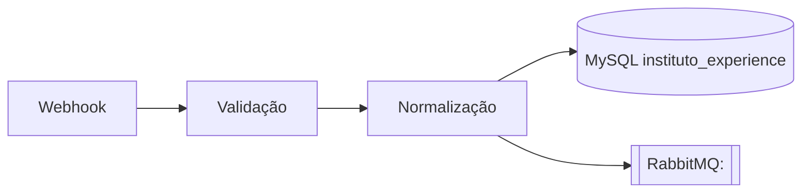

# 🔀 {{title}}

> [!info] Resumo em 1 linha
> <Uma frase: o que esse fluxo faz, de onde vem, pra onde vai.>

## Identificação

| Campo | Valor |
|---|---|
| **Direção** | `<ingestao | consumo>` |
| **Plataforma** | `<nome>` |
| **N8N hospedeiro** | `<Psyche | Pneuma | Arete | Cosmos | Telos | Nous>` |
| **URL do workflow** | `<confirmar>` |
| **Versão** | `<ex: V3.1>` |
| **Owner** | `<nome>` |
| **Última revisão** | {{date:YYYY-MM-DD}} |

## Descrição

<2–4 parágrafos. O que ele faz, em que contexto roda, o que ele NÃO faz
(escopo). Inclua decisões importantes — por que assim e não de outra forma.>

## Diagrama

> [!tip] Prefira Mermaid
> Screenshot do N8N só como complemento. Mermaid versiona melhor e mostra dependências.

## Trigger

| Item | Valor |
|---|---|
| **Tipo de gatilho** | `<webhook | cron | rabbitmq consumer>` |
| **Endpoint / fila** | `<...>` |
| **Auth** | `<assinatura HMAC | token | nenhuma>` |
| **Volume médio** | `<req/min ou msg/min>` |

## Dependências

### Plataformas / serviços externos
- `<ex: API Clickbank — endpoint X>`

### Filas RabbitMQ

| Direção | Fila | Exchange | Routing key |
|---|---|---|---|
| **publica** | `<...>` | `<...>` | `<...>` |
| **consome** | `<...>` | `<...>` | `<...>` |

### Banco de dados

| Tabela / procedure | Operação | Observação |
|---|---|---|
| `[[<tabela>]]` | INSERT | append-only |

### Outros fluxos N8N
- [[<nome do fluxo dependente>]]

## Tratamento de erro

| Cenário | Comportamento |
|---|---|
| Plataforma 5xx | `<retry com backoff | DLQ | nack>` |
| Payload inválido | `<...>` |
| DB indisponível | `<...>` |
| Timeout | `<...>` |

> [!warning] Idempotência
> <Como esse fluxo garante idempotência? Chave de dedup, upsert, hash de payload? — preencher.>

## Variáveis de ambiente / credenciais

| Nome | Onde mora | Quem aprova acesso |
|---|---|---|
| `<...>` | `<n8n credential | env var>` | `<...>` |

> [!warning] Nunca cole valor real aqui
> Só o nome da variável e onde mora. Valores ficam no cofre corporativo.

## Como testar / debugar

1. <Passo>
2. <Passo>

## Histórico de mudanças relevantes

| Data | Mudança | Link |
|---|---|---|
| {{date:YYYY-MM-DD}} | Documento criado | — |

## Referências

- Incidentes relacionados: [[<Incidente>]]
- ADRs: [[<Decisao>]]
